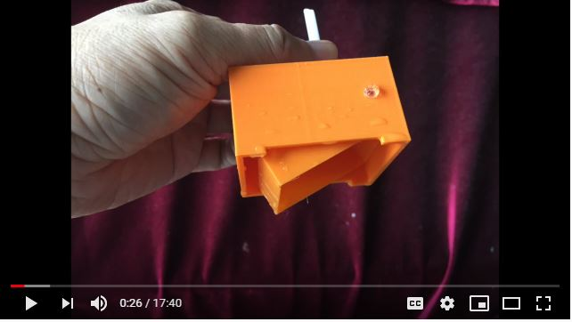

# float-valve-V1

# Designed by cheungbx (c) 2020.08.07 - free for personal use. Prohibitted use on comercial products.

# Float valve is a water level controller used in Passive Hydroponics systems.
# Install a big nutriet tanks that can supply nutrients for a month for your plans.
# Connect a pipe form the nutriet tank to the float valve.
# Place the float value at the base of the growth tank for plants or vegtable.
# The float valve will control water level not to exceed 20 mm. This is to avoid drowning the roots and keep enough space above water for airing the roots for healtfhy growthn.
# Once water level drops below 20mm, the float valve will drop allowing nutrient to flow from the nutrient tank into the growth tank. No electricity nor pumps required.
# *.f3d file is the archive file for fusion 360.
# *..stl is the common format of 3d design file.
# *.gcode is the sliced file for use in Ender 3 Pro 3D printer only.
# 3D printing instructions for Ender3 Pro : Take defaults for PLA material with these adjustments: Infill 40%,   Support off.
# The inlet pipe printed may not be durable enough. You may need to replace that with a 4.7mm ouside diameter (3mm inside diameter) platic balloon stick.
# more instructions in this youtube video:

https://youtu.be/t1FxCKXK-P4
